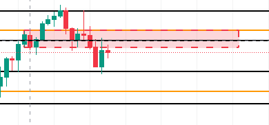
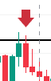
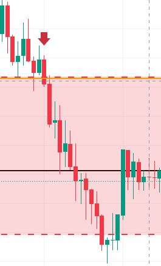
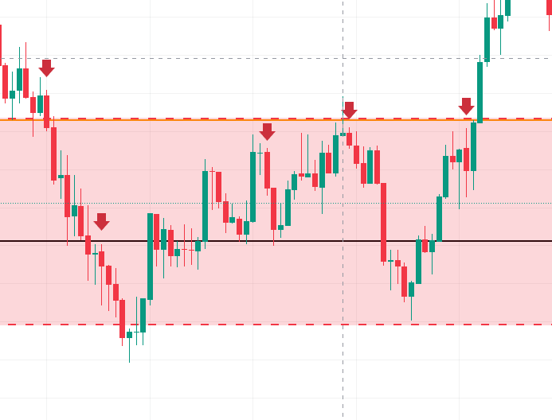
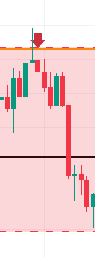
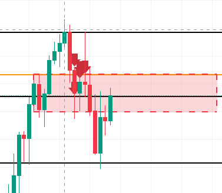
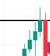
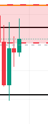

# FXチャート分析ログ：Zero Magic & CRT実践

**作成日**: 2026-02-03
**テーマ**: 環境認識、OB/FVGの判定、CRT（更新否定）の識別

---

## 1. 環境認識とOBの判定

### Q. この赤枠は有効なOBか？

**A. 判定：Sランク（鉄板）**
*   **流れ**: 4時間足の前回高値（オレンジ線）を一瞬抜けてから急落しており、Liquidity Sweep（大口の狩り）が発生している。
*   **場所**: キリ番（黒線・x.000）が絡んでおり、世界中の注文が集中するポイント。
*   **足跡**: 赤枠部分に明確なOB（Order Block）があり、その直後に強いインバランス（FVG）を伴って下落している。
*   **結論**: ここに戻ってきたら全力で売り場を探して良い。

---

## 2. エントリートリガー（包み足）

### Q. これは包み足か？

**A. 判定：合格**
*   **形**: 「上（陽線）→ 下（陰線）」の順序で、かつ陰線の実体が前の陽線の実体を完全に包み込んでいる。
*   **意味**: 買い手の抵抗を売り手が完全に粉砕した形。これがゾーン内で出ればエントリー合図となる。
*   **注意**: ゾーン外（何もない場所）で出ても見送ること。

---

## 3. エントリーの見送り判断

### Q. この赤矢印はエントリーできるか？

**A. 判定：見送り（リスクあり）**
*   **理由**: 前の陽線の「長い上ヒゲ」まで包み込めていない（Wick-to-Wickで負けている）。
*   **心理**: まだ迷いがある形。ゾーン上限までもう少し距離があるため、もう一度試しに行く（ダブルトップ形成）可能性がある。

---

## 4. 正しいエントリー箇所の特定

### Q. どの矢印が正しいエントリーか？

**A. 正解：真ん中の矢印**
*   **左**: 早すぎる。
*   **右**: ラインには触れたが、反発の陰線が弱すぎる（結果、踏み上げられている）。
*   **真ん中**: ゾーン深部まで引きつけ、かつ強力な大陰線（包み足）が出現している。

### 拡大図（Sランクの根拠）

*   **完璧なCRT**: 前の陽線の「上ヒゲ（最高値）」から「下ヒゲ（最安値）」まで、次足の陰線がすべてを飲み込んでいる。
*   **意味**: 買い手の完全敗北。これが出たら迷わずエントリー。

---

## 5. CRT（プラスα）のパターン識別

### パターンA：高値更新からの即否定

*   **更新**: 黒ライン（高値）を陽線で明確にブレイク。
*   **罠**: 飛びつき買いを誘う。
*   **否定**: 直後に全戻しして安値を割る。典型的な「ダマシ」を利用した加速パターン。

### パターンB：教科書通りのCRT

*   **評価**: Sランク（即エントリー対象）。
*   **動き**: ラインブレイク（陽線）→ 即座に頭から尻尾まで飲み込む大陰線。
*   **意味**: 「ブレイクした」という事実そのものが無かったことにされており、強烈な下降トレンド転換（買い手全滅）の合図。

### パターンC：転換（明けの明星）

*   **動き**: 陰線 → 下ヒゲ（Sweep/安値更新） → 小陰線 → **大陽線**。
*   **解説**: 厳密な2本組のCRTではないが、本質は同じ。「安値を更新してダマシになり、強く反転した」。
*   **酒田五法**: 「明けの明星（モーニングスター）」と呼ばれる強力な相場転換サイン。ロングエントリー対象。

---

## 総括
*   **待つ**: 0.000や上位足ラインなどの「強い壁」まで引きつける。
*   **見る**: そこで「更新してから否定する（CRT）」動きを確認する。
*   **撃つ**: 否定が確定した瞬間に、迷わずエントリー。

これが「Zero Magic」の極意です。
